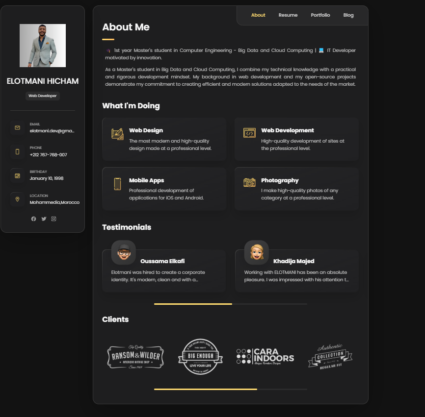

<h3><strong>Personal Portfolio</strong></h3>

Portfolio en HTML, CSS et JavaScript 🌟

<strong>Description du projet :</strong></h3>

"Ce projet est un portfolio moderne et interactif conçu avec HTML, CSS et JavaScript pour présenter mes compétences, projets, et services. Il inclut :

<ul><li>Une section 'À propos' avec des informations détaillées sur mon parcours.</li><li>Une mise en page responsive, adaptée à tous les appareils.</li><li>Des sections dynamiques pour les services, témoignages, et clients.</li><li>Une interface utilisateur élégante avec des animations fluides pour une navigation intuitive.</li></ul>

Ce portfolio met en valeur l'intégration de styles modernes, de composants réutilisables et d'un design centré sur l'utilisateur. 🚀💻"

